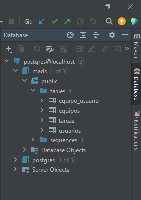
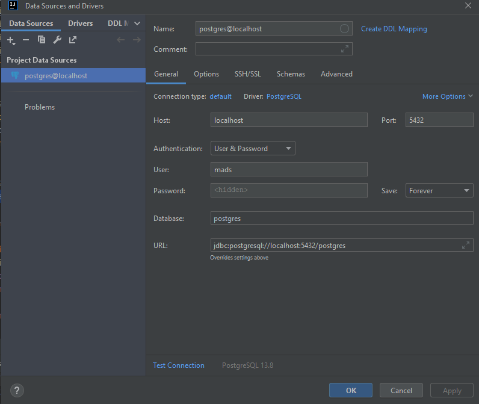

# Historias implementadas
### 009
Se han añadido 3 funcionalidades
+ Crear nuevos equipos
    + El método relacionado ya ha sido creado en la historia `008`
    + Se ha agregado un método `POST` en el controlador.
        > Se comprueba que solo los usuarios logeados puedan crear equipos.
    + La vista dispone de un `form` con un único campo nombre y un botón para crear el equipo. La ruta es `/equipos`.
    ```
    <form method="post" th:action="@{/equipos}" th:object="${equipoData}">
            <div class="form-group">
                <div class="row justify-content-center">
                    <div class="col-3">
                        <input id="NombreEquipo" class="form-control" name="NombreEquipo"
                               type="text" th:field="*{nombre}" placeholder="Nombre" required/>
                    </div>

                    <button type="submit" class="btn btn-primary">Crear</button>
                </div>
            </div>
        </form>```

    + No se han implementado tests adicionales para esta funcionalidad, puesto que ya se desarrollaron antes de la historia.

+ Entrar y salir de un equipo
    + El método para añadir un usuario a un equipo ya ha sido implementado en la historia `008`. En cambio, para salir de grupo hemos añadido un método nuevo.
    + El controlador contiene dos métodos respectivamente. Se controla que un usuario no pueda unirse a un equipo si ya esta dentro y lo mismo con salida.
    + En la vista se pone un botón o otro dependiendo de si el usuario ya esta en el equipo o no.
    ```
    /equipos/{idDetalle}/entrar
    /equipos/{idDetalle}/salir
    ```
    + Se ha implementado test `eliminarUsuario()` en `EquipoServiceTest` 

    + En `EquipoWebTest` se han implmentado 2 métodos para comprobar que un usuario puede tanto unirse como salir. 
        + `salirDeEquipo()` 
        + `UnirseAlEquipo()`

___

### 010
Se han añadido 2 funcionalidades para **administración**
> En el controlador se comprueba si el usuario es administrador
+ Eliminar equipo
    + Se ha añadido un método relacionado tanto a servicio como al controlador.
    + Tanto la vista de lista de equipos como un equipo en concreto contienen un botón para eliminar el equipo relacionado.
    ```
    /equipos/{idDetalle}/eliminar
    ```
    + Test añadido en `EquipoServiceTest`. Comprobamos que no existe el equipo y además no esta en la lista de equipos de un usuario.
    ```
    @Test
    public void eliminarEquipo(){
        Equipo equipo = equipoService.crearEquipo("Test");
        Usuario usuario = usuarioService.findById(addUsuarioAdminDB());
        equipoService.addUsuarioEquipo(usuario.getId(), equipo.getId());


        equipoService.eliminarEquipo(equipo.getId());

        assertThat(usuario.getEquipos()).hasSize(0);
        assertThat(equipoService.findAllOrderedByName()).hasSize(0);

    }
    ```
    + `EquipoWebTest` contiene test relacionado `eliminarEquipo()`.  
    
+ Cambiar el nombre de equipo
    + método en la parte de servicio añadido.
    + En el controlador se ha agregado un método de tipo `POST` que recibe datos de un formulario.
    + Al acceder a los detalles de equipo se dispone de un formulario que envía el nuevo nombre al controlador.
    ```
    /equipos/{idDetalle}
    ```
    + Tests añadidos en `EquipoServiceTest` como en `EquipoWebTest`. Ámbos se denominan `cambiarNombreEquipo()` .


### Código de interés

Aparte de los test mencionados se ha implementado uno que comprueba que un usuario que no es administrador no puede acceder a sus funcionalidades.
```
    @Test
    public void gestionEquiposUsuarioNoAdmin() throws Exception {
        Long user = addUsuarioBD();
        Long equipo = addEquipoBD();

        when(managerUserSession.usuarioLogeado()).thenReturn(user);

        this.mockMvc.perform(get("/equipos")).andExpect(content().string(doesNotContainString("Eliminar")));
        this.mockMvc.perform(get("/equipos/"+ equipo)).andExpect(status().isOk());
        this.mockMvc.perform(get("/equipos/"))
                .andExpect(content().string(doesNotContainString("Cambiar Nombre")));
        this.mockMvc.perform(post("/equipos/"+ equipo )
                .param("nombre", "Equipo con nombre cambiado"))
                .andExpect(status().isForbidden());
        this.mockMvc.perform(get("/equipos/"+ equipo + "/eliminar")).andExpect(status().isForbidden());
    }

```

Es interesante puesto que tuvimos que añadir un pequeño método para comprobar que un string no se visualiza en la página, dado que no hemos encontrado un método preinstalado:
```
private Matcher<String> doesNotContainString(String s) {
        return CoreMatchers.not(containsString(s));
    }
```

### Imagen de la Base de datos






# Enlaces de interes
[GitHub](https://github.com/mads-ua-22-23/mads-todolist-sv54)

[ToDoList MADS | Trello](https://trello.com/b/xww3NmiV/todolist-mads)

[Docker Hub](https://hub.docker.com/repository/docker/sergswa7/mads-todolist)
